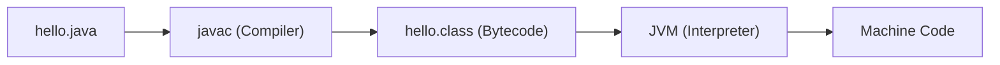
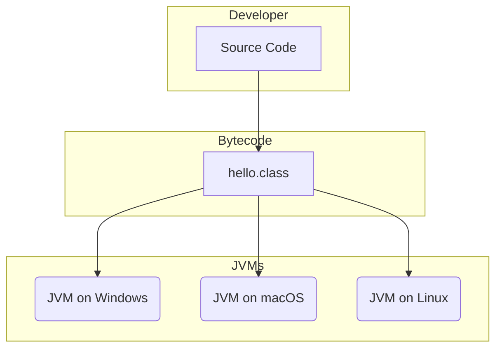
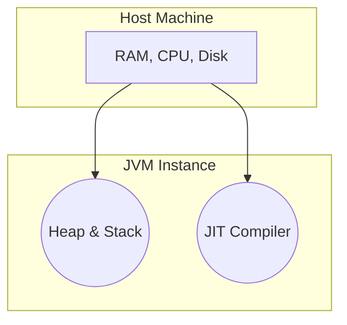
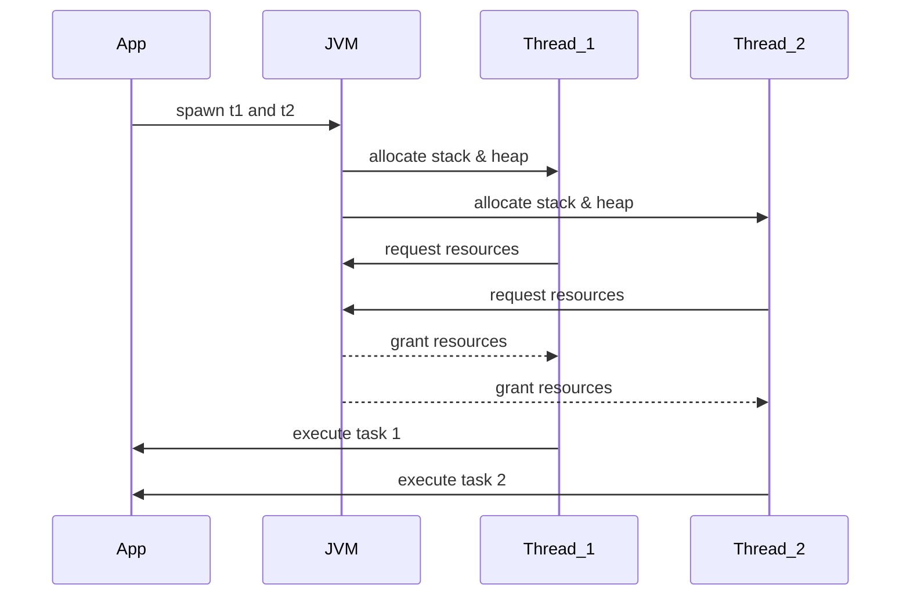

# Why Java?

Java stands out among programming languages for its combination of performance, portability, and safety. Unlike scripting languages such as JavaScript or Python, Java offers both compiled and interpreted paradigms, which gives developers deeper insights into how code executes under the hood.

## Key Benefits

* **Deep Understanding of Execution**: See exactly what happens from source code to machine code.
* **Compiled + Interpreted**: Java is first compiled to bytecode and then interpreted by the JVM; Python, by contrast, is purely interpreted.
* **Compile-Time vs. Runtime Checks**:

  * **Compile-Time**: Syntax and type errors are caught before the program runs.
  * **Runtime**: The JVM handles dynamic checks, memory management, and security at execution time.

- **Compiler**: Transforms human-readable Java source (`.java`) into platform-independent bytecode (`.class`).
- **Interpreter (JVM)**: Translates bytecode into machine-specific instructions on the fly.
- **Bytecode**: A compact, intermediate representation that the JVM understands.

## Java Compilation & Execution Flow

1. `javac` compiles `hello.java` → `hello.class` (bytecode).
2. The JVM loads and verifies bytecode, then converts it into machine code at runtime.
3. Bytecode ensures **platform independence**—"Write Once, Run Anywhere."

---

# Platform Independence

A core strength of Java is its **platform independence**. By targeting the JVM rather than a specific operating system, Java applications can run unmodified on any device with a compatible JVM.

* **Write Once, Run Anywhere**: Developers compile code once into bytecode and distribute it across different OS environments (Windows, macOS, Linux, etc.).
* **Architecture Neutral**: Bytecode abstracts away hardware differences (CPU architecture, endianness).

---

# What Is the JVM?

The **Java Virtual Machine (JVM)** is an abstract computing machine that enables Java applications to run on any device or operating system.

* **Virtual Machine**: A sandboxed instance that uses host resources:

  * **Memory**: e.g., 500 MB of RAM
  * **CPU**: e.g., 10% processing power
  * **Storage**: e.g., 2 GB disk space
* **Isolation**: Ensures that Java threads and processes run in a controlled environment, enhancing security and stability.

---

# Threads in the JVM

Java threads are units of execution managed by the JVM. They allow concurrent operations while ensuring safety through isolation.

* **Definition**: A `Thread` is a lightweight subprocess within the JVM, sharing the same memory space but with its own call stack.
* **Thread Safety**: Since threads operate inside the JVM’s managed memory, the JVM enforces synchronization and prevents many low-level errors.
* **Performance**: Slightly slower than native threads in C++, but gains safety and portability.

### Thread Workflow

---

# Java vs C++ and Other Backend Languages

When choosing a backend language, Java offers several advantages over C++ and other popular options:

| Aspect                    | Java                                      | C++                                                  | Other Backends (Node.js, Python, Go)                  |
| ------------------------- | ----------------------------------------- | ---------------------------------------------------- | ----------------------------------------------------- |
| **Portability**           | Bytecode + JVM → runs anywhere            | Must recompile per platform                          | Varies (interpreted languages less consistent)        |
| **Memory Management**     | Automatic garbage collection              | Manual allocation/deallocation (prone to leaks)      | Garbage collection (Go), interpreter-managed (Python) |
| **Type Safety**           | Strongly typed, compile-time checks       | Strongly typed, compile-time but undefined behaviors | Dy*namically type*d (Python, Node.js) or static (Go)  |
| **Performance**           | JIT optimizations                         | Native speed, no overhead                            | Varies (Go close to native; JS/Python slower)         |
| **Concurrency Model**     | Thread-based with synchronized primitives | Thread/lock; manual synchronization                  | Event-driven (Node.js), goroutines (Go)               |
| **Ecosystem & Libraries** | Mature, enterprise-grade                  | Mature but lower-level                               | Rapidly evolving (Node.js, Python), growing (Go)      |
| **Tooling & Monitoring**  | Rich profiling, JMX, mature IDE support   | Profilers available, but more complex setup          | Tools improving (e.g., Node.js APMs, Go pprof)        |

* **Robust Ecosystem**: Java’s rich set of frameworks (Spring, Hibernate) accelerates development.
* **Enterprise Adoption**: Widely used for large-scale systems with long-term support.
* **Security**: Built-in sandboxing and security manager in the JVM.

---

> **Flow Summary**:
>
> 1. Write `hello.java`
> 2. Compile with `javac` → `hello.class`
> 3. Run on JVM → machine code
> 4. Enjoy cross-platform compatibility, safety, and robust tooling.

