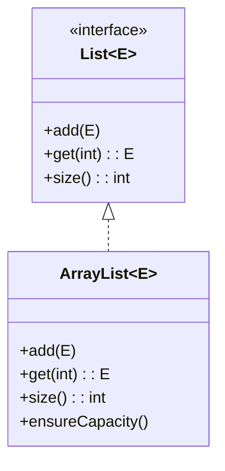
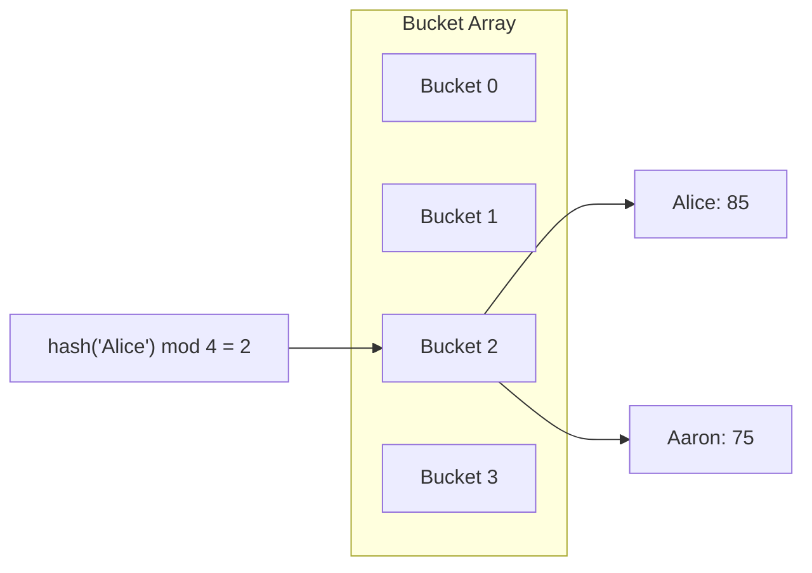
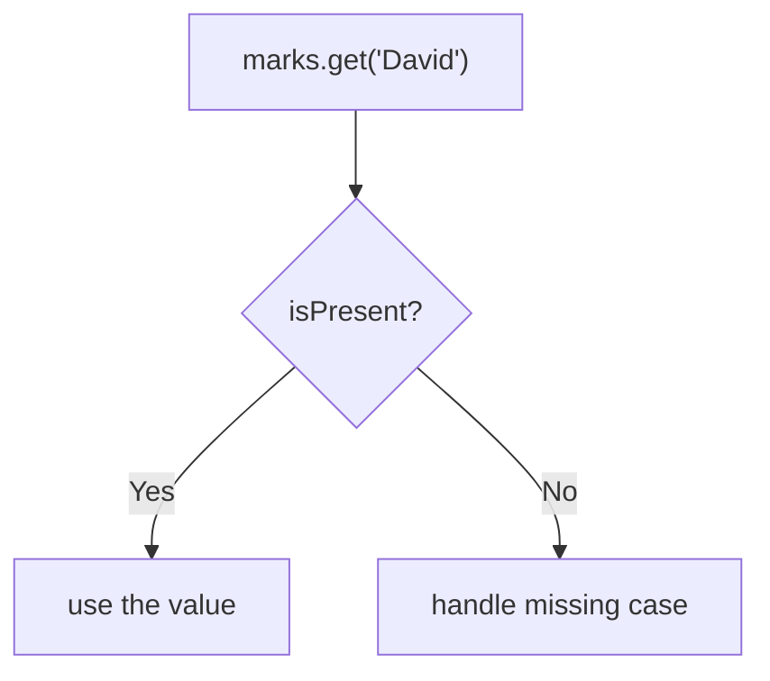

# Java Advanced Concepts

Welcome to **java-advanced.md**! This guide will walk you through some advanced—but essential—Java topics:  
- **Generics & Collections**  
- **List vs. ArrayList**  
- **Map & HashMap**  
- **Null-safety with `Optional`**

Throughout, you’ll find code examples and **diagrams** (via Mermaid) to make the concepts interactive and memorable.

---

## 1. Generics & Collections

Java **Collections Framework** defines common data structures (Lists, Maps, Sets, etc.). Generics (`<E>`) let you specify element types at compile time, improving safety.

```java
// A List of String objects
List<String> names = new ArrayList<>();
names.add("Alice");
// names.add(123);    // ❌ compile-time error
````

### UML: List Interface → ArrayList Class



> **Why use the `List` interface?**
> Declaring `List<String> list = new ArrayList<>();` makes your code more flexible—later you can switch to `LinkedList` or any other `List` implementation without changing method signatures.

---

## 2. Working with `List`

```java
List<String> arr = new ArrayList<>();
arr.add("Hello");
arr.add("World");
System.out.println("Size: " + arr.size());  // Size: 2
System.out.println(arr.get(1));             // World
```

* **Common methods**:

  * `add(E e)`
  * `get(int index)`
  * `remove(int index)` / `remove(Object o)`
  * `size()`

---

## 3. Maps: `Map<K, V>` & `HashMap`

A **Map** holds key–value pairs.

```java
Map<String, Integer> marks = new HashMap<>();
marks.put("Alice", 85);
marks.put("Bob",   90);
marks.put("Charlie", 95);

for (Map.Entry<String,Integer> entry : marks.entrySet()) {
    System.out.printf("%s scored %d%n",
                      entry.getKey(), entry.getValue());
}
```

### Diagram: HashMap Buckets



> **What if a key is missing?**
> `marks.get("David")` returns `null`. If you then do `marks.get("David") > 100`, you’ll get a NullPointerException.

---

## 4. Null-Safety with `Optional`

Instead of raw `null`, use `Optional<T>` to express “value present or not.”

```java
// Wrap possibly-null result
Optional<Integer> maybeDavid = Optional.ofNullable(marks.get("David"));

if (maybeDavid.isPresent()) {
    System.out.println("David's score: " + maybeDavid.get());
} else {
    System.out.println("David's score is not available.");
}
```

### Flowchart: Handling Optional



> **Key methods**
>
> * `Optional.of(value)` — wrap non-null value
> * `Optional.ofNullable(value)` — wrap value or empty if `null`
> * `isPresent()`, `get()`, `orElse(default)`, `ifPresent(consumer)`

---

## 5. Putting It All Together

```java
import java.util.*;

public class Test {
    public static void main(String[] args) {
        // 1. Generics & List
        List<String> arr = new ArrayList<>();
        arr.add("Hello");
        System.out.println("List size: " + arr.size());

        // 2. Map & iteration
        Map<String, Integer> marks = new HashMap<>();
        marks.put("Alice", 85);
        marks.put("Bob",   90);
        marks.put("Charlie", 95);

        for (var e : marks.entrySet()) {
            System.out.println(e.getKey() + " scored " + e.getValue());
        }

        // 3. Handle missing key safely
        Optional<Integer> davidScore = Optional.ofNullable(marks.get("David"));
        System.out.println(
            davidScore.map(s -> "David's score: " + s)
                      .orElse("David's score is not available.")
        );
    }
}
```

---

### Further Exercises

1. **Experiment**: Swap `ArrayList` for `LinkedList` and compare performance on random inserts.
2. **Challenge**: Use `Map.merge()` to aggregate scores for duplicate keys.
3. **Deep dive**: Read about `ConcurrentHashMap` for thread-safe maps.
